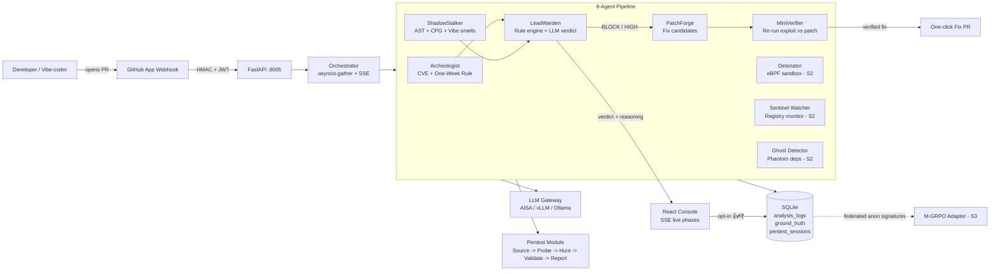

# Sentinel-AI — Product Overview

> Local-first, multi-agent supply-chain + runtime security platform for GitHub PRs and shipped code.
> Detect → Detonate → Patch → Verify, end-to-end, on a single box.

---

## 1. Why now

- **xz-utils (Mar 2024)** — 8 days from upload to ~1.2M servers exposed. Maintainer was the attack surface, not the code.
- **EU Cyber Resilience Act** — enforcement Dec 2024; vendors liable for supply-chain CVEs.
- **AI-code explosion** — GitHub Octoverse 2024: Copilot suggests ~46% of new lines in active repos. Vibe-coding patterns (`chmod 0o777`, hallucinated imports, `cors=*`) now ship at scale.
- **Snyk + Socket gaps exposed** — neither catches install-hook obfuscation in <7-day-old maintainer accounts.

If three megatrends converge in one window, that's a market.

---

## 2. Market

| Class | Tools | Gap |
|---|---|---|
| SCA scanners | Snyk, Socket, Dependabot, Endor | Read code, never run it. Miss obfuscation + maintainer trust. |
| AI code reviewers | CodeRabbit, Copilot Review | Style/quality, not exploitability. |
| Pentest engines | Burp, Shannon, ZAP | Runtime-only, no PR-time loop, expensive (~$50/scan). |
| Cloud SaaS scanners | All of the above | Code leaves customer infra → blocked by FedRAMP/HIPAA/air-gap. |

**TAM math (Gartner AppSec + Octoverse 2024):**

- **Global AppSec market:** $9.5B (2024) → $30B (2030) — Gartner.
- **Wedge: PR-time supply-chain + AI-code review.** 100M GitHub repos × 5% active (>5 contributors) × 40% security-priority × blended $90/mo ARPU = **$540M ARR addressable on indie+SMB tiers**.
- **Enterprise upside:** Snyk ~$400M ARR (2024) off SCA alone; Wiz $500M+ off cloud-runtime. Combined Sentinel wedge sits at the intersection — comp range supports **$1B+ category leader**.

---

## 3. Product

**Sentinel-AI is an immune system for your repo.** Install GitHub App → every PR runs an 8-agent pipeline → BLOCK/REVIEW/APPROVE verdict + verified patch + one-click fix PR — in 5–60 seconds, $0 marginal, never leaves the box.

### 3.1 System workflow

5 live agents (Archeologist, ShadowStalker, LeadWarden, PatchForge, MiniVerifier) + 3 scaffolded (Detonator, Watcher, Ghost). Pentest module runs OWASP runtime exploits against customer-authorised targets (180s wall clock, allowlisted egress, written-auth gate in UI).

---

## 4. How it helps developers + vibe-coders patch leaky codebases

| Pain | Sentinel-AI cure |
|---|---|
| "Dependabot opened 40 PRs, I ignore them all." | One BLOCK comment with **why**, reasoning chain, CVSS, one-click *verified* fix PR. |
| "Copilot wrote my auth, did it leak tokens?" | Vibe-Coding detector flags hallucinated stdlib imports, `chmod 0o777`, `cors=*`, swallowed network exceptions. |
| "New dep maintainer looks sketchy." | **One-Week Rule** — flag any account <7d old publishing install hooks. Catches xz, event-stream, ua-parser-js retroactively. |
| "Did the patch actually fix it?" | MiniVerifier re-runs the exploit against the patch; ships `fully_verified: true` only when blocklist + Shannon pass. |
| "Can't send code to a SaaS." | Local-first. Zero default telemetry. FedRAMP / HIPAA / air-gapped out of the box. |
| "AI black-box verdicts are unfixable." | Every verdict ships a numbered reasoning chain — human-auditable line by line. |
| "Already shipped, is prod exploitable?" | Pentest module runs OWASP runtime exploits against authorised targets, returns proof-carrying report. |

---

## 5. Differentiation (the moat)

1. **Detonate-then-decide** — only platform combining static SCA + behavioural sandbox + PR-time loop. CodeRabbit literally cannot do this.
2. **Closed-loop verification** — every patch re-runs the original exploit. "No exploit, no report" + "no fix, no merge."
3. **One-Week Rule** — viral, simple, historically validated; no commercial scanner enforces it.
4. **Local-first as compliance wedge** — unopposed in FedRAMP / HIPAA / air-gapped buyers.
5. **Schema-first** — every Stage-2/3 output already has a Pydantic schema. Forward growth = integration, not redesign.
6. **Federated RL flywheel** — opt-in anonymised attack signatures (not source) → Mutant Factory amplification → M-GRPO adapter. Compounding moat competitors cannot buy.

**Defensibility vs incumbents (GitHub/Snyk clone in 6 months?):** local-first compliance + closed-loop MiniVerifier + RL adapter trained on customer FP corpus — three orthogonal moats. Cloud-native SaaS competitors cannot replicate the first without rebuilding their entire delivery model.

---

## 6. Traction & metrics (current MVP)

| Metric | Value |
|---|---|
| Live agents in pipeline | 5 / 8 |
| Lines of Python (excl. venv) | ~5,000 |
| Tests passing | 75+ unit + integration |
| **FP-rate CI gate** | **< 8%** (build fails if breached) |
| Median scan latency | 5–30s |
| p95 scan latency | ≤ 45s |
| LLM backends supported | 3 (AISA / vLLM / Ollama) |
| Pentest module | P0 live (Injection hunter), P1 in flight |
| External integrations | OSV.dev, NVD, npm, PyPI, crates.io, GitHub App, Slack, Joern, FalkorDB |
| Repo, branch ready | `dev_v3`, Apache 2.0 |

Design-partner pipeline: OSS-maintainer DM templates in [`oss_maintainer_dms.md`](oss_maintainer_dms.md); first pilots targeted Q3 2026.

---

## 7. Future scope

| Horizon | Scope |
|---|---|
| **Q3 2026** | 4 remaining Pentest hunters (Auth, AuthZ, XSS, SSRF) · workspace snapshots + resume · GitHub Marketplace listing · FP corpus to 100 · 5 design-partner repos |
| **Q4 2026** | Detonator (eBPF + mitmproxy sandbox) wired live · PatchForge auto-PR at scale · Postgres + multi-tenant · Stripe billing · SOC2 Type I prep |
| **2027** | M-GRPO-trained per-agent QLoRA adapters (cloud-GPU runner: Modal/Lambda/RunPod) · Mutant Factory (synthetic attack corpus, 5k+ samples) · Graphiti memory layer · SBOM + SPDX evidence pack · first enterprise deal ($30k+) |
| **2028+** | A2A agent marketplace (third-party hunters plug in) · Firecracker VM detonators · IDE extensions · multi-region · FedRAMP ATO · Series A |

---

## 8. Business model (scalable + sellable)

- **Unit economics flip the SaaS curve.** Inference on customer's box → marginal cost per scan ≈ $0. Competitors bound by cloud GPU spend; we're bound by customer laptop. **Gross margin >95% from day one.**
- **Three-layer monetisation:** OSS-core (Apache 2.0, adoption funnel) → Pro/Team SaaS ($49/$149 mo, indie + SMB) → **Sentinel Forge** enterprise ($30k+/yr, per-tenant QLoRA adapter trained on customer code in customer VPC; cloud-GPU runner or on-prem appliance). Same precedent: Sentry, Datadog Agent, GitLab.
- **Pricing ladder:** Free (100 PRs/mo, public repos) → Pro $49 → Team $149 → Enterprise $30k+. Year-1 paid baseline: design-partner pilots → marketplace listing → 10x via GitHub App distribution.
- **GTM motion:** OSS-maintainer DM funnel (templates ready) → GitHub Marketplace listing (Q3 2026) → demo screencast viral → outbound to FedRAMP-track buyers (regulated wedge).
- **Why not built by GitHub/Snyk:** local-first kills their delivery model; closed-loop verifier requires a sandbox they don't run; RL adapter needs the FP corpus only we're harvesting.

---

## 9. Data sovereignty — the long-arc bet

Frontier LLMs are not differentiated by architecture; they are differentiated by **data**. OpenAI's Daybreak coding-agent push and Anthropic's Claude coding mythos both crystallised because vast volumes of developer code, PR reviews, and bug-fix transcripts flowed into their training pipelines. The harness is generic; the corpus is everything. A 70B model with no domain data is inert; a 7B model with the right corpus beats it on the only benchmark that matters — *the customer's own codebase*.

The current default is a one-way leak: companies pipe proprietary source, internal infra, and unreleased product code into ChatGPT / Claude / Copilot through IDE plugins. By 2027 the largest hidden cost on every enterprise balance sheet will not be cloud GPU spend — it will be **the data they irreversibly gave away**.

Sentinel-AI inverts the flow. Because the pipeline runs locally, every scan, every patch, every 👍/👎, every false-positive labelled by a human reviewer stays inside the customer's perimeter. Three compounding consequences:

1. **Customer-owned corpus → customised models.** Per-tenant QLoRA adapter trained on the customer's coding style, infra conventions, and production traffic shape. The model becomes *theirs* — secure codebases, lower FP rate, verdicts that match their engineering culture, zero IP leakage. This is Sentinel Forge.
2. **Delta extraction as growth signal.** We never see customer source, but the *diff* between baseline model and tenant adapter (gradient magnitudes, layer activation drift, anonymised attack-signature distributions) is opt-in research fuel. Compounding across the install base = the dataset no SaaS competitor can reconstruct.
3. **Path to AGI runs through owned data.** The next decade of coding agents will be won by whoever owns the closed-loop "developer wrote → exploit found → patch verified → human labelled" dataset. We are engineered to harvest exactly that loop, ethically.

**Scale advantage — India.** 1.4B population, 5.8M professional developers (NASSCOM 2024), projected largest global dev base by 2027. Sentinel-AI's local-first model means an Indian SMB or solo vibe-coder runs the same pipeline as a Fortune 500 — zero per-seat cloud-GPU drag. We expect early adoption velocity from the Indian developer market; the labelled corpus harvested at population scale becomes a geographic data moat no US/EU SaaS competitor can replicate.

> The model is rented. The data is owned. Sentinel-AI is the only platform engineered around that asymmetry.

---

## 10. Team & ask

- **Team:** 2 builders today; founder-market fit = supply-chain security + ADK agent systems + production FastAPI.
- **Stage:** MVP operational, demo-ready. Seeking design partners + Anthropic Fellows compute (research output: M-GRPO for security agents).
- **Ask:** Hackathon track — recognition + design-partner intros. Seed track — $750k–$1.5M, 18-month runway to Stage-3 close: M-GRPO trained adapters, first $30k+ enterprise deal, SOC2 Type I, 5 paid Team-tier accounts.

> "Build the loop. Train with M-GRPO. Ship locally. Win the compliance buyers." — the playbook in one line.
