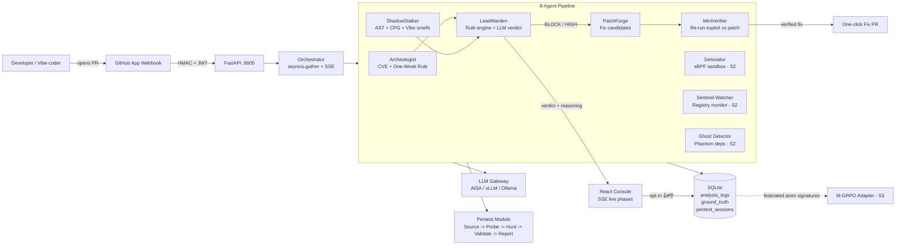
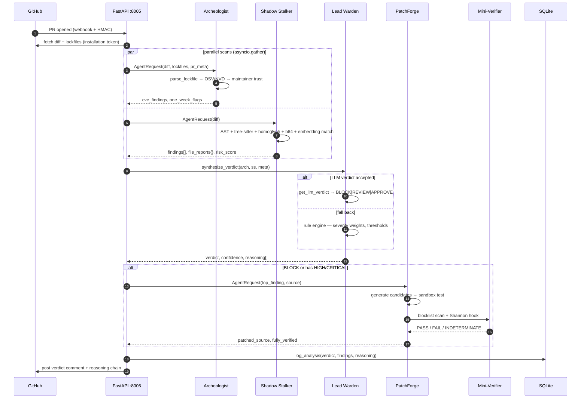
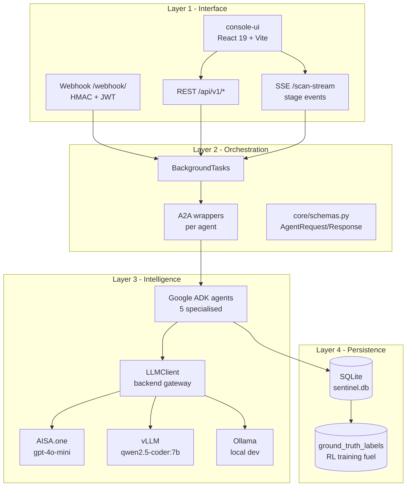
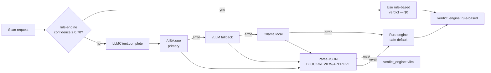

# Sentinel-AI

**Autonomous, multi-agent supply-chain security for every Pull Request — running 100% on your own infrastructure.**

> Stop xz-style attacks before they merge. No code ever leaves your network.

[]()
[]()
[]()
[]()
[]()
[]()

---

## 1. The problem

Modern supply-chain attacks (xz-utils, event-stream, ua-parser-js, PyTorch nightly) succeed because the existing toolchain is structurally blind to *how* they actually work:

| Class of tool | Examples | Structural gap |
|---|---|---|
| **SCA scanners** | Snyk, Socket, Dependabot | Match known CVEs in a lockfile. Cannot detect a *new* malicious package, a hijacked maintainer, or an install-time payload. |
| **AI code reviewers** | CodeRabbit, GitHub Copilot review, SonarQube | Score *style* and *bugs*, not exploitability. Don't execute the code. Blind to homoglyphs, base64-chained payloads, hidden execution in `__del__`/`atexit`/`process.on('exit')`. |
| **Pentesters / DAST** | Burp, Shannon, ZAP | Operate at runtime against deployed services. Have no PR-time loop, no fix proposal, no closed verification. |

The three blind spots compound:

1. **The maintainer is the attack surface.** A compromised account can publish malicious code that *every* lockfile-pinning, *every* SCA scanner, and *every* reviewer happily accepts.
2. **Obfuscation defeats grep.** Cyrillic homoglyphs, `eval(compile(b64decode(...)))`, `chr()`-built builtin names, payloads hidden in `except`/`__del__`/`atexit`/`process.on('exit')` are invisible to linters and AI reviewers tuned for code quality.
3. **No one closes the loop.** Even when a fix is proposed, nothing re-runs the original exploit against the patch. "The LLM thinks it's fixed" is not a verification.

Nobody owns the seam between *static review* and *behavioral verification* at PR time.

---

## 2. What Sentinel-AI does

Sentinel-AI is a coordinated **immune system** — five specialized AI agents, each owning a different attack surface, run together in a **Detect → Decide → Patch → Verify → Learn** loop on every pull request. Everything runs locally on commodity hardware.



The architecture pulls the seam closed: static review *and* behavioral verification, both at PR time, both local-first.

---

## 3. The agent roster

Each agent lives at `agents/<name>/` with `agent.py` (Google ADK definition), `tools.py` (typed tool functions), and `a2a_wrapper.py` (Agent-to-Agent invocation shim).

| # | Agent | Role |
|---|---|---|
| 1 | **Archeologist** | OSV + NVD CVE lookup, npm/PyPI maintainer probe, **One-Week Rule** |
| 2 | **Shadow Stalker** | AST + tree-sitter: homoglyph, base64-exec, install hooks, dangerous calls, vibe-coding smells |
| 3 | **Lead Warden** | Verdict synthesis (rule engine + LLM), reasoning chain, attack class |
| 4 | **PatchForge** | Generate fix candidates → test → verify → open remediation PR |
| 5 | **Mini-Verifier** | Closed loop: static blocklist + Shannon PoC re-execution |

---

## 4. Detection sequence (single PR)



---

## 5. System architecture



Single architectural contract: `core/config.py` controls every backing. Swap SQLite→Postgres, Ollama→vLLM→AISA, Docker→Firecracker without touching agent code.

---

## 6. LLM strategy



Per-request override: the UI Settings tab passes `llm_provider` / `llm_model` / `llm_key` per scan — no restart, no env reload.

---

## 7. What makes the detection different

* **The One-Week Rule** — flag any package whose latest publishing maintainer registered <7 days ago. Retroactively hits xz-utils, event-stream, and ua-parser-js. No commercial scanner enforces it.
* **Homoglyph + obfuscation chain detection** — Cyrillic look-alikes, `eval(compile(b64decode(...)))`, `chr()`-built builtin names, `__del__`/`atexit`/`process.on('exit')` payloads. AST + tree-sitter, not regex alone.
* **Vibe-coding detector** (`agents/shadow_stalker/vibe_detector.py`) — flags AI-generated code smells: `chmod 0o777`, `cors=*`, hallucinated stdlib imports, generic `except Exception: pass` next to network calls.
* **Phantom-dep & typosquat** — finds packages installed but undeclared, plus Levenshtein + Soundex against top-10k names.
* **Closed-loop verifier** — every PatchForge candidate runs through static blocklist (`eval`, `exec`, `__import__`, `subprocess shell=True`, `base64+exec`) **and** Shannon PoC re-execution. Patches ship `fully_verified: true` only when both pass. Failed candidates are demoted to confidence 0.0 — they don't reach the user.
* **Verdict explains itself** — every BLOCK comment ships with a numbered reasoning chain a human can sanity-check line by line. No black-box score.

---

## 8. Verdict scoring

```
Severity weights:  CRITICAL = 10   HIGH = 5   MEDIUM = 2   LOW = 0.5
Verdict thresholds: ≥ 15 → BLOCK   ≥ 5 → REVIEW   < 5 → APPROVE
Homoglyph bonus:   +5  (strong supply-chain indicator)
```

Every response includes: `verdict`, `confidence`, `severity`, `risk_score`, `attack_classification`, `reasoning[]`, `agent_scores{}`, `findings_count{}`, `verdict_engine` (`vllm` | `rule-based`).

---

## 9. Quickstart

### Prerequisites
* Python 3.11+, Node 20+
* One of: [Ollama](https://ollama.com) with `qwen2.5-coder:7b`, a vLLM endpoint, or an AISA.one API key
* A GitHub App + public tunnel (`ngrok`) for webhook mode — *optional* for local scan via `/api/v1/scan`

### 1. Install
```bash
git clone https://github.com/ramprasathk07/Sentinel-AI.git
cd Sentinel-AI
python -m venv .venv && .venv\Scripts\activate    # PowerShell: .venv\Scripts\Activate.ps1
pip install -r requirements.txt
npm --prefix console-ui install
```

### 2. Configure `.env`
```ini
# LLM (pick one)
LLM_BACKEND=aisa            # aisa | vllm | ollama
AISA_API_KEY=sk-...
# AISA_BASE_URL=https://api.aisa.one/v1
# VLLM_BASE_URL=http://localhost:8000
# OLLAMA_BASE_URL=http://localhost:11434
VERDICT_MODEL=qwen2.5-coder:7b

# GitHub App (only for webhook mode)
GITHUB_APP_ID=
GITHUB_WEBHOOK_SECRET=
GITHUB_PRIVATE_KEY_PATH=./secrets/sentinel-app.private-key.pem

# Optional
NVD_API_KEY=
SLACK_WEBHOOK_URL=
```

### 3. Run
```powershell
# Build the console UI once
npm --prefix console-ui run build

# Start backend (serves built UI at http://localhost:8005)
python run.py

# OR dev mode (UI hot-reload at :5173, API at :8005)
npm --prefix console-ui run dev
```

### 4. Scan without GitHub App
```bash
curl -X POST http://localhost:8005/api/v1/scan \
  -H "Content-Type: application/json" \
  -d '{"repo":"owner/repo","pr_number":42,"github_token":"ghp_..."}'
```

---

## 10. API surface

| Method | Path | Purpose |
|---|---|---|
| POST | `/api/v1/scan` | Single PR scan |
| POST | `/api/v1/scan-stream` | SSE — emits `stage:*` events for UI animation |
| POST | `/api/v1/scan-repo` | Bulk scan all open PRs |
| POST | `/api/v1/watch` | Register webhook on a repo |
| DELETE | `/api/v1/watch/{owner}/{repo}` | Unwatch |
| POST | `/api/v1/patch` | Run PatchForge on a single finding |
| POST | `/api/v1/create-fix-pr` | One-click open remediation PR |
| GET | `/api/v1/history[?repo=]` | Recent scans from SQLite |
| GET | `/api/v1/history/{owner}/{repo}/{pr}` | Full detail for one analysis |
| POST | `/webhook/` | GitHub App primary receiver |
| POST | `/api/v1/webhook/token/{repo_key}` | Per-repo signed webhook |
| GET | `/healthz` | LLM + DB + git rev liveness |

---

## 11. Local-first as a feature

| Concern | Cloud SCA / AI reviewers | Sentinel-AI |
|---|---|---|
| Where does my code go? | Their cloud, their logs | Your VPS / laptop. Zero exfil. |
| Per-repo cost | $$ / seat, indexed | $0 marginal — local LLM or BYO key |
| Compliance posture | Their SOC2 (good) — data flows out | Yours — fits FedRAMP, HIPAA, air-gapped |
| Latency on PR | Their queue | Your machine, ~5–60s end-to-end |
| Custom rules + training data | Enterprise-tier lock-in | Every 👍/👎 = your training corpus |

---

## 12. Testing

```
tests/
  agents/         7 unit suites — mocked LLM, no network
  integration/    test_mini_verifier.py + test_fp_rate.py (8% FP-rate CI gate)
  fixtures/       safe_prs/ · verifier/ corpora
```

* `pytest tests/` — full suite (~75 tests).
* CI: `.github/workflows/ci.yml` — Python 3.11 + 3.12 matrix, `ruff` + `pytest`, FP-rate gate.

---

## 13. Repository layout

```
Sentinel-AI/
├── agents/
│   ├── archeologist/          CVE + maintainer trust (cpg_analyzer, embedding_store)
│   ├── shadow_stalker/        AST + obfuscation scan (vibe_detector)
│   ├── lead_warden/           Verdict engine
│   ├── patchforge/            Fix generation (vllm_wrapper)
│   └── mini_verifier/         Closed-loop blocklist + Shannon
├── api/                       FastAPI: main.py + routes/{scan,watch,webhook}.py + github.py
├── core/                      schemas, config, agent_base, A2A registry
├── llm/llm_client.py          AISA / vLLM / Ollama gateway
├── storage/                   SQLite logger + ground-truth JSON dumper
├── utils/                     diff_parser, lockfile_parser, formatter, logger
├── prompts/                   Lead Warden + style rules
├── console-ui/                React 19 + Vite SPA → served from /
├── tests/                     unit (mocked) + integration (FP gate) + fixtures
├── docs/                      TECHNICAL · THREAT_MODEL · MINI_VERIFIER · SHANNON_INTEGRATION ...
└── run.py                     uvicorn entry point (port 8005)
```

---

## 14. Documentation

| Document | Purpose |
|---|---|
| [`docs/TECHNICAL.md`](docs/TECHNICAL.md) | Deep architecture, schemas, infra, gaps |
| [`docs/IMPLEMENTATION_PLAN.md`](docs/IMPLEMENTATION_PLAN.md) | Stage 1 → 4 roadmap, KPIs, unlock order |
| [`docs/SHANNON_INTEGRATION.md`](docs/SHANNON_INTEGRATION.md) | Wiring Shannon (KeygraphHQ) + Mutant Factory |
| [`docs/MINI_VERIFIER.md`](docs/MINI_VERIFIER.md) | Pure-Python verifier for classes Shannon doesn't cover |
| [`docs/THREAT_MODEL.md`](docs/THREAT_MODEL.md) | STRIDE, prompt-injection defence, sandbox posture |
| [`docs/HACKATHON_SUBMISSION.md`](docs/HACKATHON_SUBMISSION.md) | Hackathon pitch + claim → evidence map |
| [`docs/PITCH_NOTES.md`](docs/PITCH_NOTES.md) | Market sizing, demo recipe, business model |
| [`docs/false_positives.md`](docs/false_positives.md) | Living FP log — Stage 3 RL training data |
| [`docs/Sentinel_AI_Master_Blueprint.docx`](docs/Sentinel_AI_Master_Blueprint.docx) | Master strategy + funding doc |

---

## 15. Roadmap

```
Stage 0  ✅  Hardening: /healthz, replay harness, CI matrix, 8% FP-rate gate, threat model
Stage 1  ✅  5 agents live — Archeologist · Shadow Stalker · Lead Warden · PatchForge · Mini-Verifier
              Closed-loop verifier · React 19 console · SSE streaming · one-click fix PR
Stage 2  ⏳  Detonator (eBPF + mitmproxy sandbox) · Sentinel Watcher (registry deltas)
              Ghost Detector (phantom deps + typosquat) · Postgres swap · billing
Stage 3  ⏳  M-GRPO trained adapters · Mutant Factory · full Shannon integration
              SBOM (CycloneDX + SPDX) · SOC2
Stage 4  ⏳  A2A marketplace · FedRAMP ATO · Series A
```

---

## 16. Security posture

Full threat model in [`docs/THREAT_MODEL.md`](docs/THREAT_MODEL.md). Highlights:

* **HMAC + JWT** on every webhook
* **Background-task offload** — webhook returns 200 OK in <100ms
* **Prompt-injection defence** — system prompt always wins, JSON mode forced, refusal parser falls back to rule engine
* **No outbound code transfer** — diff + lockfiles processed locally; only verdict/comment leaves the box (to GitHub)

---

## 17. Status & contributing

All five pipeline agents are operationally functional. Highest-leverage contributions:

* Attack-pattern PRs to `agents/shadow_stalker/known_patterns.py`
* False-positive reports against [`docs/false_positives.md`](docs/false_positives.md)
* Verifier corpora in `tests/fixtures/verifier/`

## License

Currently undetermined for public release. Roadmap targets an OSS core + commercial Pro/Enterprise tier. See [`docs/PITCH_NOTES.md` § Licensing](docs/PITCH_NOTES.md#licensing--business-model).
