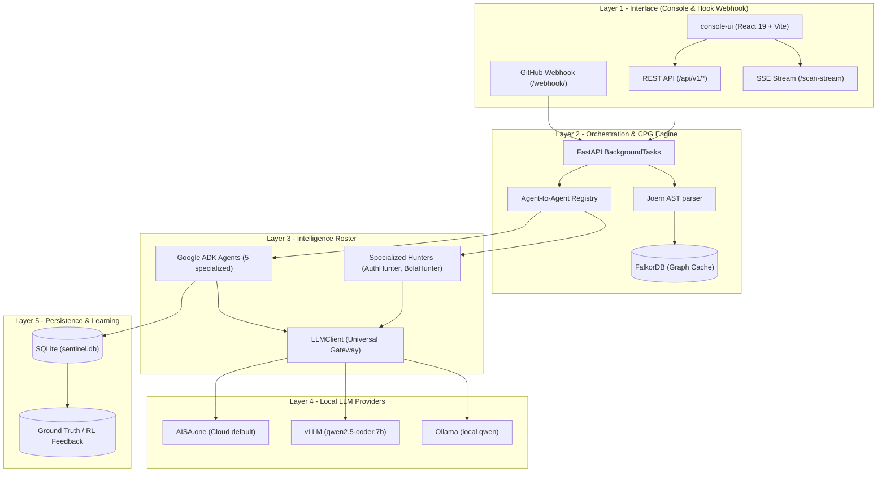

# 🛡️ Sentinel-AI

**Autonomous, Multi-Agent Supply-Chain Security & PR-Time Pentesting — Running 100% on your own Local Infrastructure.**

> Stop zero-day supply-chain exploits (like `xz-utils`) and runtime vulnerabilities *before* they merge. Fully local-first, zero code exfiltration.

---

## 🌟 Overview

Sentinel-AI acts as a coordinated **immune system** for your repositories. By deploying specialized, cooperative AI agents on every Pull Request, Sentinel-AI performs **hybrid threat detection**: combining deep static analysis (AST & Code Property Graphs) with dynamic runtime analysis (automated pentesting and verification). Everything executes locally on your hardware, preserving absolute privacy.

### The Core Pillars
1. **🔍 Supply-Chain Hardening**: Flags cyrillic homoglyphs, obfuscated base64 payload injection, malicious install-time hooks, phantom dependencies, and typosquatting.
2. **🕸️ Graph-Based Code Property Graph (CPG)**: Generates detailed structural graphs of code using **Joern**, persisting them to **FalkorDB** for cross-layer structural exploration.
3. **⚡ Closed-Loop Remediation**: Generates fixes via **PatchForge**, validates them in a sandbox using the **Mini-Verifier** and **Shannon PoC** execution, and opens safe, ready-to-merge remediation PRs.

---

## 🏗️ System Architecture

Sentinel-AI operates as a clean, four-layer local-first architecture. It coordinates asynchronous agent executions, handles SQLite & FalkorDB persistence, and hosts a rich React-based dashboard.



---

## 🔄 Dynamic Pull Request Scan Sequence

This sequence diagram illustrates how a PR trigger orchestrates the agent roster, generates structural graphs, performs security analysis, and closes the remediation loop automatically:

```mermaid
sequenceDiagram
    autonumber
    participant GH as GitHub App
    participant API as FastAPI (:8005)
    participant CPG as FalkorDB Graph
    participant A as Archeologist Agent
    participant S as Shadow Stalker Agent
    participant L as Lead Warden Agent
    participant P as PatchForge Agent
    participant V as Mini-Verifier
    participant DB as SQLite DB

    GH->>API: PR Opened (Webhook + HMAC validation)
    API->>GH: Fetch diff & lockfiles (Installation Token)
    
    rect rgb(15, 15, 30)
        note right of API: Step 1: Parallel Analysis & CPG Parsing
        par Generate AST Code Property Graph
            API->>CPG: Run Joern + Persist AST/CFG Nodes
        and Run Archeologist
            API->>A: Inspect lockfiles & OSV/NVD vulnerabilities
            A-->>API: cve_findings[], one_week_flags[]
        and Run Shadow Stalker
            API->>S: Scan AST & check dangerous patterns (Tree-sitter)
            S-->>API: static_findings[], risk_score
        end
    end

    rect rgb(30, 15, 15)
        note right of API: Step 2: Synthesis & Verdict
        API->>L: Request synthesis of findings (Lead Warden)
        L->>L: Evaluate rule weights + LLM verification
        L-->>API: verdict (BLOCK | REVIEW | APPROVE), reasoning_chain[]
    end

    rect rgb(15, 30, 15)
        note right of API: Step 3: Sandboxed Patch & Verify
        alt Verdict is BLOCK / HIGH severity findings present
            API->>P: Request candidate patches (PatchForge)
            P->>P: Generate fixes in local scratch workspace
            P->>V: Verify patch (static blocklist + Shannon PoC execution)
            V-->>P: PASS / FAIL verification report
            P-->>API: patched_source, fully_verified: true
        end
    end

    API->>DB: Persist logs, scan history, & telemetry
    API->>GH: Post verdict status + detailed reasoning markdown comment
```



---

## 🤖 The Agent Roster

Each agent lives in `agents/<name>/` and implements a clean interface defining typed inputs, tools, and shim abstractions.

| # | Agent / Hunter | Focus Area | Key Indicators Checked |
|---|---|---|---|
| 1 | **Archeologist** | OSV/NVD CVE lookup & registry telemetry | **One-Week Rule** (recent package maintainer registrations), typosquatting, Levenshtein distance metrics. |
| 2 | **Shadow Stalker** | AST & Tree-sitter static inspection | Cyrillic homoglyphs, `base64` payload execution chains, unsafe install-time hooks (`preinstall`/`postinstall`). |
| 3 | **Lead Warden** | Verdict coordination & severity weighting | Synthesizes findings, assigns risk scores, selects LLM vs. rule engine verdicts, outputs plain explanation chains. |
| 4 | **PatchForge** | Remediation generation | Generates precise, targeted patches, connects credentials safely to `.env` variables, builds diff snapshots. |
| 5 | **Mini-Verifier** | Sandboxed patch validation | Verifies PatchForge candidates against a static blocklist (`eval`, shell `exec`) and runs live Shannon PoC scripts. |
| 6 | **AuthHunter** | Authentication vulnerability specialist | Detects missing authorization gates, weak authentication tokens, and exposed access routes. |
| 7 | **BolaHunter** | Broken Object Level Authorization (BOLA) | Validates resource accesses to prevent ID-harvesting and direct database references. |

---

## 🛠️ The Tech Stack

### Static & Structural Analysis
- **Tree-sitter**: Fine-grained parser generating abstract syntax trees (AST) for multiple languages.
- **Joern**: Advanced source analysis tool creating multi-layered Code Property Graphs (combining AST, Control Flow Graph, and Program Dependence Graph).
- **FalkorDB**: Graph database storing Joern graphs, allowing ultra-fast Cypher-based graph traversals.

### Local LLMs & Reasoning Gateways
- **Ollama / vLLM**: Run high-quality coding assistants (e.g., `qwen2.5-coder:7b`) 100% locally.
- **AISA.one**: A unified reasoning gateway providing robust universal API key integrations.

### Database & Storage
- **SQLite**: Local relational database (`sentinel.db`) tracking scan histories, watching states, and building reinforcement learning (RL) training datasets.

---

## 🖥️ Console UI Suite

The React 19 dashboard provides developers and security teams with clear visual control:

* **Scan Dashboard**: Enter a repository and PR number to launch a multi-agent scan, visualising progress via live Server-Sent Events (SSE).
* **CPG Graph Viewer**: Interactive 2D/3D graph visualization allowing developers to click nodes (functions, blocks, parameters) and inspect their structural context, data-flow metrics, and AST variables.
* **Remediation & Patching**: Interactive side-by-side comparison (Before/After) of generated patches, complete with verifier report checks and a single-click "Apply to Local File" or "Open Remediation PR" utility.
* **Settings Panel**: Encrypt and store your GitHub Access Tokens and API keys locally in your browser using secure **AES-256-CBC** key derivation tied to Google OAuth credentials.

---

## 🚀 Quickstart

### Prerequisites
1. **Python**: 3.11 or higher
2. **Node.js**: v20 or higher
3. **Docker**: Running (required for FalkorDB graph storage)

### Step 1: Clone and Set Up Dependencies
```bash
# Clone repository
git clone https://github.com/ramprasathk07/Sentinel-AI.git
cd Sentinel-AI

# Create virtual environment and activate
python -m venv .venv
# On Windows PowerShell:
.venv\Scripts\Activate.ps1
# On macOS/Linux:
source .venv/bin/activate

# Install requirements
pip install -r requirements.txt
npm --prefix console-ui install
```

### Step 2: Spin Up FalkorDB
Launch the FalkorDB graph database container using Docker:
```bash
docker run -p 6379:6379 -d --name falkordb falkordb/falkordb:latest
```

### Step 3: Configure Environment variables
Create a `.env` file in the root directory:
```ini
# LLM Provider Configuration
LLM_BACKEND=ollama            # options: ollama | vllm | aisa
VERDICT_MODEL=qwen2.5-coder:7b

# Optional API Keys
# AISA_API_KEY=sk-...
# NVD_API_KEY=

# GitHub Tokens (Can also be configured via Settings View)
# GITHUB_TOKEN=ghp_...
```

### Step 4: Build and Launch
```bash
# Build production UI assets
npm --prefix console-ui run build

# Start FastAPI and web hook backend server
python run.py
```
Visit **`http://localhost:8005`** in your browser to view the dashboard! 

*For active UI hot-reloading development (Vite Dev Server), run:*
```bash
npm --prefix console-ui run dev
```

---

## 🧪 Testing

The repository maintains full unit and integration test coverage:

```bash
# Run all unit tests
pytest tests/

# Run the Mini-Verifier integration tests
pytest tests/integration/test_mini_verifier.py
```

---

## 📂 Repository Layout

```
Sentinel-AI/
├── agents/                    # Cooperating ADK Agents
│   ├── archeologist/          # CVE, typosquats, & maintainer checks
│   ├── shadow_stalker/        # AST & static code scanning
│   ├── lead_warden/           # Verdict engine & weight synthesis
│   ├── patchforge/            # Targeted fix candidate generator
│   └── mini_verifier/         # Sandboxed blocklist & PoC test verifier
├── api/                       # FastAPI Server layer & routes
├── core/                      # Schema contracts & registry bases
├── llm/                       # Unified LLM client connector
├── storage/                   # SQLite persistence schemas & metrics
├── utils/                     # Lockfile/diff parsing utilities
├── console-ui/                # React 19 + Vite dashboard
├── tests/                     # Unit and Integration test matrices
└── run.py                     # Primary backend entry point
```
